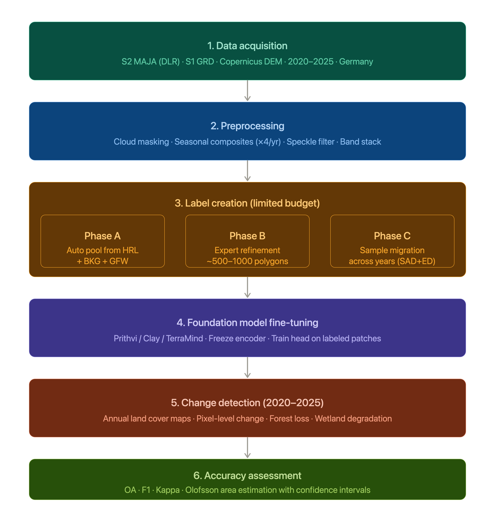

# GeoAI for Tracking Deforestation & Wetland Loss in Germany (2020–2025)

## Table of Contents

1. [Why Does This Matter? The Problem at a Glance](#1-why-does-this-matter)
2. [Key Concepts: What Is Remote Sensing?](#2-key-concepts-what-is-remote-sensing)
3. [Sentinel Satellite Data: Comparing Types](#3-sentinel-satellite-data-comparing-types)
4. [Why Combine Sentinel-1 + Sentinel-2 + DEM?](#4-why-combine-sentinel-1--sentinel-2--dem)
5. [Germany-Specific Datasets](#5-germany-specific-datasets)
6. [What Are Geospatial Foundation Models?](#6-what-are-geospatial-foundation-models)
7. [Proposed Workflow: Step by Step](#7-proposed-workflow-step-by-step)
8. [Label Strategy: How to Create Training & Test Data](#8-label-strategy-how-to-create-training--test-data)
9. [Evaluation & Accuracy Assessment](#9-evaluation--accuracy-assessment)
10. [Summary Table & Recommendations](#10-summary-table--recommendations)
11. [References & Data Sources](#11-references--data-sources)

---

## 1. Why Does This Matter?

Germany has lost significant forest and wetland areas over the past decades due to **bark beetle outbreaks**, **drought stress** (especially 2018–2020), **land conversion**, and **peatland drainage for agriculture**. Between 2018 and 2022, Germany lost roughly 500,000 hectares of forest — a crisis visible from space.

**Peatlands** are especially critical: they store enormous amounts of carbon, and their degradation releases CO₂. The EU's Nature Restoration Law and Germany's national biodiversity strategy both require regular, accurate monitoring of these habitats.

> **Why can't we just look at photos?** Germany covers 357,000 km². Manual inspection of even a fraction of this area every year is impossible. Satellites can image the entire country every few days — and AI can read those images automatically.

---

## 2. Key Concepts: What Is Remote Sensing?

Think of remote sensing like taking a photograph from a very high altitude — but instead of just capturing visible light (like a phone camera), satellites can also "see" invisible wavelengths like infrared, microwaves, or radar.

| Term | Plain-Language Explanation |
|---|---|
| **Pixel** | The smallest unit in a satellite image, like a tiny square on the ground (e.g., 10m × 10m) |
| **Band / Channel** | A specific range of light that the satellite measures (e.g., red, green, near-infrared) |
| **Land Cover** | What physically covers the ground: forest, water, bare soil, buildings |
| **Change Detection** | Comparing two images from different dates to find what changed |
| **Classification** | Assigning a label (e.g., "forest", "peatland") to each pixel |
| **Training Data / Labels** | Examples given to the AI so it learns what each type looks like |
| **Ground Truth** | Verified field measurements or high-confidence reference data |

---

## 3. Sentinel Satellite Data: Comparing Types

The ESA Copernicus programme provides free, open-access satellite data through the **Sentinel** family of satellites. For land monitoring in Germany, the most relevant are:

---

### 3.1 Sentinel-1 — Radar (SAR)

**What it does:** Sends out microwave pulses and measures the signal bounced back from the Earth's surface. This is called **Synthetic Aperture Radar (SAR)**.

**Key facts:**

* Works **day and night, through clouds and rain** — extremely important for Germany's cloudy climate
* C-band radar (~5.4 GHz)
* 10 m spatial resolution (GRD product)
* Current operational constellation:

  * Sentinel-1A
  * Sentinel-1C (launched in 2024, restoring full constellation capability)
* Revisit time: ~6 days (with two operational satellites)
* Measures **backscatter** — how strongly a surface reflects radar signals
* Polarizations: **VV** (vertical-vertical) and **VH** (vertical-horizontal)

**What it sees well:**

* Flooded areas and wetlands (water absorbs radar → very dark signal)
* Forest structure (canopy density, biomass)
* Soil moisture
* Bare soil vs. vegetated land
* Agricultural field conditions

**Limitation:** Cannot directly identify tree species or subtle vegetation types as well as optical sensors.

---

### 3.2 Sentinel-2 — Optical (Multispectral)

**What it does:** Captures reflected sunlight across 13 spectral bands from visible blue to shortwave infrared (SWIR).

**Key facts:**

* 13 spectral bands
* 10 m resolution (for key bands), 20 m for vegetation-specific bands
* Revisit: every 5 days
* Level-2A surface reflectance products are operationally available across Europe and globally
* DLR provides Germany-specific Level-2A tiles processed with the **MAJA algorithm**, offering improved atmospheric correction and cloud masking compared to standard ESA products

**Important bands for our task:**

| Band            | Name                | Wavelength   | What it tells us                      |
| --------------- | ------------------- | ------------ | ------------------------------------- |
| B2              | Blue                | 490 nm       | Water bodies, aerosols                |
| B3              | Green               | 560 nm       | Vegetation vigour                     |
| B4              | Red                 | 665 nm       | Chlorophyll absorption                |
| B8              | Near-Infrared (NIR) | 842 nm       | Healthy vegetation → high reflectance |
| B5, B6, B7, B8A | Red Edge            | 705–865 nm   | Forest stress, species discrimination |
| B11, B12        | SWIR                | 1610–2190 nm | Soil moisture, dead wood, burn scars  |

**Key vegetation index:**

* **NDVI** = (B8 − B4) / (B8 + B4): Ranges from -1 to +1; healthy dense forest → ~0.7–0.9

**Additional useful indices:**

* **NDWI**: Surface water and wetland detection
* **NDMI**: Vegetation moisture content
* **NBR**: Burn severity and disturbance mapping
* **EVI**: Enhanced vegetation monitoring in dense forests

**Limitation:** Clouds block the signal. Germany averages 150–180 cloudy days per year. A single Sentinel-2 image may be >50% cloud-covered.

---

### 3.3 Sentinel-3 — Coarse-Resolution Land/Ocean Monitor

**What it does:** Provides medium-resolution observations of land, ocean, and atmosphere using instruments such as OLCI (Ocean and Land Colour Instrument) and SLSTR (Sea and Land Surface Temperature Radiometer).

**Key facts:**

* 300 m resolution (OLCI)
* Daily to near-daily global coverage
* Measures vegetation productivity, land surface temperature, and drought indicators

**Useful for:**

* Large-scale vegetation trend monitoring
* National-scale NDVI analysis
* Drought and heat stress monitoring
* Climate and ecosystem studies

**Limitation:** Too coarse for local/regional forest mapping or habitat classification in Germany.

---

### 3.4 Sentinel-4 — Geostationary Atmospheric Monitoring

**What it does:** Monitors atmospheric composition over Europe from geostationary orbit using instruments hosted on Meteosat Third Generation satellites.

**Key facts:**

* Hourly observations across Europe
* Measures:

  * Nitrogen dioxide (NO₂)
  * Ozone (O₃)
  * Sulfur dioxide (SO₂)
  * Formaldehyde (HCHO)
  * Aerosols
* Designed primarily for air-quality monitoring

**Useful for:**

* Assessing pollution impacts on forests
* Studying atmospheric stressors affecting ecosystems
* Environmental impact assessments

**Limitation:** Does not provide land-surface imagery and cannot be used for vegetation or habitat mapping.

---

### 3.5 Sentinel-5P — Atmospheric Composition

**What it does:** Measures atmospheric trace gases using the TROPOMI instrument.

**Key facts:**

* Monitors:

  * Methane (CH₄)
  * Nitrogen dioxide (NO₂)
  * Carbon monoxide (CO)
  * Sulfur dioxide (SO₂)
  * Ozone (O₃)
* Global daily coverage
* Provides some of the highest-resolution atmospheric composition measurements currently available from space

**Useful for:**

* Monitoring greenhouse gas emissions
* Detecting methane emissions from peatland degradation
* Studying air quality and ecosystem interactions
* Supporting climate and carbon accounting studies

**Limitation:** Spatial resolution is far too coarse for direct forest or wetland mapping.

---

### 3.6 Sentinel-6 — Sea Level and Climate Monitoring

**What it does:** Measures global sea-surface height using radar altimetry, continuing the long-term climate record established by the TOPEX/Poseidon and Jason missions.

**Key facts:**

* Centimetre-level sea-surface height measurements
* Global ocean coverage
* Supports long-term climate monitoring

**Useful for:**

* Climate change studies
* Coastal wetland vulnerability assessments
* Hydrological and climate modelling

**Limitation:** No land-cover or vegetation imaging capability.

---

### Comparison Table: Sentinel Satellites for Forest/Wetland Monitoring

| Feature                    | Sentinel-1 (SAR) | Sentinel-2 (Optical) | Sentinel-3 | Sentinel-4           | Sentinel-5P | Sentinel-6      |
| -------------------------- | ---------------- | -------------------- | ---------- | -------------------- | ----------- | --------------- |
| **Spatial Resolution**     | 10 m             | 10–20 m              | 300–1000 m | Atmospheric Products | ~3.5–7 km+  | Altimetry Track |
| **Works in clouds?**       | ✅ Yes            | ❌ No                 | ❌ No       | N/A                  | N/A         | N/A             |
| **Works at night?**        | ✅ Yes            | ❌ No                 | Partial    | ✅ Yes                | ✅ Yes       | ✅ Yes           |
| **Vegetation detail**      | Moderate         | ✅ High (13 bands)    | Moderate   | ❌ None               | ❌ None      | ❌ None          |
| **Wetland detection**      | ✅ Excellent      | Good                 | Moderate   | ❌ No                 | Indirect    | ❌ No            |
| **Tree species**           | Poor             | ✅ Good (red edge)    | Poor       | ❌ No                 | ❌ No        | ❌ No            |
| **Atmospheric monitoring** | ❌ No             | ❌ No                 | Limited    | ✅ Excellent          | ✅ Excellent | ❌ No            |
| **Climate monitoring**     | Moderate         | Moderate             | ✅ Strong   | Strong               | Strong      | ✅ Strong        |
| **Free & open?**           | ✅ Yes            | ✅ Yes                | ✅ Yes      | ✅ Yes                | ✅ Yes       | ✅ Yes           |

---

### Data combination for our problem

For forest and wetland monitoring in Germany:

1. **Sentinel-2** → primary vegetation and habitat classification.
2. **Sentinel-1** → cloud-independent wetland, flood, and moisture monitoring.

---

## 4. Why Combine Sentinel-1 + Sentinel-2 + DEM?

The key insight from the Moharrami et al. (2024) study in *Remote Sensing* is powerful: **combining SAR (S1) and optical (S2) data achieves 98.25% accuracy in sample migration**, compared to 87.68% for S1 alone or 96.82% for S2 alone.

Here's the intuition for why combination wins:

```
S2 alone: Great spectral detail, but blind when it's cloudy 
          (Germany has many cloudy days → temporal gaps in data)

S1 alone: Sees through clouds always, but confuses spectrally 
          similar surfaces (e.g., wet grassland vs. shallow water)

S1 + S2: Complementary — S2 identifies WHAT it is, 
          S1 confirms WHEN/WHERE change occurred under clouds
```

### Add DEM (Digital Elevation Model)

A **DEM** (like the Copernicus DEM at 25m or TanDEM-X at 12m from DLR) adds topographic context:

- Peatlands are typically low-lying (river valleys, flat plains)
- Slope and wetness index help distinguish peatland from mineral wetland
- Forests at high elevation vs. low elevation have different drought responses

**Recommended input stack per time step:**

- S2 bands: B2, B3, B4, B5, B6, B7, B8, B8A, B11, B12
- Derived indices: NDVI, NBR (normalized burn ratio), NDWI (water index)
- S1: VV, VH backscatter (and VV/VH ratio)
- DEM-derived: Elevation, slope, Topographic Wetness Index (TWI)

---

## 5. Germany-Specific Datasets

### 5.1 Primary Satellite Data

| Dataset | Source | Use |
|---|---|---|
| **S2 MAJA L2A tiles – Germany** | DLR GeoService (doi: 10.15489/ifczsszkcp63) | Best atmospherically corrected S2 data for Germany; improved cloud/shadow detection using temporal context (MAJA algorithm). Available from July 2015 to present. |
| **Sentinel-1 GRD** | Copernicus Open Access Hub / GEE | All-weather SAR backscatter |
| **Copernicus DEM (COP-DEM)** | ESA / Copernicus | 25m elevation data |
| **TanDEM-X DEM** | DLR | 12m very high resolution DEM for Germany |

> The DLR MAJA product is superior to standard ESA S2 products for Germany because MAJA uses **temporal series** to robustly detect clouds and aerosols — particularly important in cloudy central European conditions. It provides **Flat Surface Reflectance (FRE)** values directly usable for vegetation analysis.

### 5.2 Reference / Label Data

| Dataset | Type | Use |
|---|---|---|
| **BKG ATKIS DLM** | National topographic database (Germany) | Forest boundaries, wetland areas — use as initial label pool |
| **Copernicus Land Service HRL Forest** | Pan-European, 10m | Forest type, canopy cover 2018 baseline |
| **Copernicus Land Service HRL Wetlands** | Pan-European, 10m | Permanent & temporary wetland maps |
| **GlobalForestWatch / Hansen et al.** | 30m annual tree cover loss | Forest change reference 2020–2023 |
| **BWI (Bundeswaldinventur)** | German national forest inventory | Ground truth for forest structure |
| **OpenStreetMap + field campaigns** | Mixed | Validation points |
| **Sentinel-2 Cloudless Mosaic (SCL)** | ESA | Visual interpretation for label generation |

---

## 6. What Are Geospatial Foundation Models?

### The Traditional Approach (and Its Problems)

Classical machine learning for land cover mapping works like this:

1. Collect many labeled examples ("this pixel = forest")
2. Train a model specifically for your area and time period
3. Model works well **only** for that area/time — poor generalization

**Problems:**

- Label collection is expensive and time-consuming
- Model degrades when applied to new regions or new years
- Cannot leverage knowledge from other datasets

### Foundation Models: A New Paradigm

A **foundation model** (FM) is pre-trained on **massive, diverse datasets** — sometimes millions of satellite images from around the world — using self-supervised learning (no labels needed for pre-training). It learns general representations of the Earth's surface.

Think of it like this: a person who has spent years looking at maps and satellite images from every continent will be much better at interpreting a new image than someone who only studied a small region.

**After pre-training, you "fine-tune" the model with a small number of labeled examples for your specific task** — much less data needed than training from scratch.

---

### Top Geospatial Foundation Models

| Model | Developer | Pre-training Data | Strengths | Modalities |
|---|---|---|---|---|
| **Prithvi** | NASA + IBM | Sentinel-2 HLS time series (global) | Multi-temporal, flood/fire/crop detection | Optical (S2) |
| **TerraMind** | ESA / Industry | Multi-modal satellite data | Any-to-any generation, multi-modal | S1, S2, DEM, optical |
| **Clay** | Clay Foundation | S1, S2, NAIP, LINZ | Open-source, flexible embeddings | S1, S2, optical |
| **Google PDFM** | Google | Diverse geospatial signals | Large scale, zero-shot classification | Multi-modal |
| **SatMAE** | Stanford | Sentinel-2 multispectral + temporal | Time-series understanding | Optical |
| **SpectralGPT** | Various | Hyperspectral data | Fine spectral discrimination | Hyperspectral |

### Why Foundation Models Beat Traditional DL for Our Task

| Challenge | Traditional Deep Learning | Foundation Model |
|---|---|---|
| Limited training data | Needs thousands of labels | Works with dozens to hundreds |
| New time period (2020→2025) | Retrain from scratch | Fine-tune quickly |
| Cloud gaps in S2 | Hard to handle | Handles missing data via pre-training |
| Zero-shot new classes | Cannot classify unseen classes | Can generalize |
| Multi-sensor fusion | Requires careful architecture design | Built-in multi-modal capability (TerraMind) |

---

## 7. Proposed Workflow: Step by Step

Here is the full pipeline, explained simply at each stage.



```
┌─────────────────────────────────────────────────────────────────────┐
│                   1. DATA ACQUISITION                               │
│          • S2 MAJA (DLR) + S1 GRD (Copernicus) + COP-DEM            │
│          • Period: 2020–2025 | Scope: Germany                       │
└──────────────────────────┬──────────────────────────────────────────┘
                           │
                           ▼
┌─────────────────────────────────────────────────────────────────────┐
│                   2. PREPROCESSING                                  │
│  • Cloud masking (MAJA CLM layer for S2)                            │
│  • Median compositing per season (spring/summer/autumn)             │
│  • S1 preprocessing: speckle filtering, terrain correction          │
│  • Stack all layers per time step                                   │
└──────────────────────────┬──────────────────────────────────────────┘
                           │
                           ▼
┌─────────────────────────────────────────────────────────────────────┐
│               3. LABEL CREATION (LIMITED BUDGET)                    │
│  Step A: Automated label pool from BKG/HRL/GlobalForestWatch        │
│  Step B: Manual refinement of ~500–1000 high-confidence polygons    │
│  Step C: Sample migration across years (Moharrami et al. method)    │
└──────────────────────────┬──────────────────────────────────────────┘
                           │
                           ▼
┌─────────────────────────────────────────────────────────────────────┐
│          4. FOUNDATION MODEL FINE-TUNING (Prithvi or Clay)          │
│  • Extract embeddings from pre-trained encoder                      │
│  • Fine-tune classification head with our labeled data              │
│  • Multi-temporal input: use seasonal composites 2020–2025          │
└──────────────────────────┬──────────────────────────────────────────┘
                           │
                           ▼
┌─────────────────────────────────────────────────────────────────────┐
│                   5. CHANGE DETECTION                               │
│  • Binary: "Changed" vs. "Unchanged" per pixel, per year            │
│  • Semantic: Forest → Degraded Forest → Clear-cut / Peatland → Dry  │
│  • Time series analysis: when did the change happen?                │
└──────────────────────────┬──────────────────────────────────────────┘
                           │
                           ▼
┌─────────────────────────────────────────────────────────────────────┐
│                 6. ACCURACY ASSESSMENT & REPORTING                  │
│  • Hold-out test set (stratified, never used in training)           │
│  • Overall Accuracy, F1-score, Kappa coefficient                    │
│  • Area estimates with uncertainty bounds (Olofsson method)         │
└─────────────────────────────────────────────────────────────────────┘
```

### Step-by-Step Details

#### Step 1: Data Acquisition

- Download **Sentinel-2 MAJA L2A** tiles for Germany via DLR GeoService (`geoservice.dlr.de`) or the STAC API
- Download **Sentinel-1 GRD** backscatter via Google Earth Engine (GEE) or Copernicus Open Hub
- Download **Copernicus DEM** at 25m
- Use **Google Earth Engine** as the processing platform — it's free for research and stores all Sentinel data pre-loaded

#### Step 2: Preprocessing

For each year (2020–2025), create **seasonal composites**:

| Season | Months | Why useful |
|---|---|---|
| Spring | March–May | Detect green-up; distinguish deciduous vs. evergreen |
| Summer | June–August | Peak vegetation signal; best NDVI for forest health |
| Autumn | Sept–Nov | Leaf senescence reveals tree stress |
| Winter | Dec–Feb | S1 especially useful; canopy structure without leaves |

**For S2:** Use the MAJA cloud mask (CLM band) to exclude cloudy pixels, then take the median of all valid observations per season.

**For S1:** Apply a Refined Lee speckle filter (9×9 window), convert to dB scale, derive seasonal median of VV, VH, and VV/VH ratio.

#### Step 3: Label Creation (Budget-Conscious Strategy)

Since labels are limited but not zero:

**Phase 1 — Automated label pool (~0 field cost)**

- Use HRL Forest Layer (2018 baseline) + GlobalForestWatch loss data → automatic "loss" polygons
- Use BKG ATKIS wetland layer → baseline wetland polygons
- These provide hundreds of thousands of candidate samples — but quality varies

**Phase 2 — Expert refinement (~500–1000 polygons)**

- Visually inspect candidate polygons in GEE using cloud-free S2 composites
- Assign confidence level (high / medium / uncertain)
- Focus labeling effort on **change pixels** and **ambiguous transition zones** (degraded forest, paludiculture areas)
- Keep only high-confidence samples for training

**Phase 3 — Sample migration across years (Moharrami et al. method)**

- Take high-quality 2024 labels
- Migrate backwards to 2020–2023 using Euclidean Distance (ED) and Spectral Angle Distance (SAD) thresholds
- This multiplies your label count across 5 years without proportional field effort
- Threshold: ED < 0.15 and SAD > 0.95 → pixel considered "stable/unchanged" and label transferred

**Class labels for our task:**

| Class | Description |
|---|---|
| Intact Forest | Dense, healthy canopy (NDVI > 0.6, stable S1) |
| Degraded Forest | Reduced canopy, stress signs (NDVI 0.3–0.6, increasing S1 variability) |
| Clear-cut / Deforested | Open land where forest existed (NDVI drop, bright S1) |
| Intact Peatland/Wetland | Wet ground, specific S1 signature, often near rivers |
| Degraded Peatland | Drained, vegetated differently, lower soil moisture |
| Other Vegetation | Agriculture, grassland |
| Water | Lakes, rivers |
| Urban/Bare | Buildings, roads, bare soil |

#### Step 4: Foundation Model Fine-Tuning

**Recommended model: Prithvi (NASA/IBM) for optical time-series, or Clay for multi-modal**

```python
# Conceptual workflow (using Prithvi)

# 1. Load pre-trained Prithvi encoder
encoder = PrithviEncoder.from_pretrained("ibm-nasa-geospatial/Prithvi-100M")

# 2. Prepare input: multi-temporal S2 patches (e.g., 4 seasons × 6 bands)
# Shape: [batch, time_steps, bands, height, width]
inputs = prepare_seasonal_composites(germany_s2_maja, years=range(2020,2026))

# 3. Extract embeddings (no labels needed)
embeddings = encoder(inputs)  # Rich feature representations

# 4. Add lightweight classification head
classifier = SegmentationHead(in_features=768, num_classes=8)

# 5. Fine-tune with our ~500-1000 labeled samples
# This requires far less data than training from scratch
model = finetune(encoder, classifier, labeled_samples)
```

**Why Prithvi specifically?**

- Pre-trained on 1M+ Sentinel-2 HLS image chips globally (multi-temporal)
- Proven on flood, fire, and land-cover tasks
- MIT-licensed, open weights available on HuggingFace
- Accepts multi-temporal stacks → perfect for seasonal composites

**Alternative: TerraMind** if multi-modal (S1 + S2 combined) is needed natively — it supports "any-to-any" modality.

#### Step 5: Change Detection

Apply the fine-tuned model to produce **annual land cover maps** for 2020–2025, then:

1. **Pixel-level change:** Compare class label in year T vs. year T-1 per pixel
2. **Trajectory analysis:** Track pixels across all 6 years to identify gradual degradation
3. **Key transitions to flag:**
   - Intact Forest → Degraded Forest (bark beetle, drought)
   - Degraded Forest → Clear-cut
   - Intact Peatland → Degraded Peatland (drainage)

---

## 8. Label Strategy: How to Create Training & Test Data

### Practical Split

Given limited resources:

```
Total labeled polygons: ~1,000 (target)
├── Training set:    70%  → 700 polygons (fed to model)
├── Validation set:  15%  → 150 polygons (tune hyperparameters)
└── Test set:        15%  → 150 polygons (NEVER touched until final evaluation)
```

**Crucially:** The test set must be **spatially stratified** — spread across different German forest regions (Schwarzwald, Harz, Bayerischer Wald, Spreewald for peatlands) so the model is evaluated on its geographic generalization.

### Sample Representation Strategy

Use **stratified sampling** to ensure all classes are represented, especially rare ones:

| Class | Suggested % of labels |
|---|---|
| Intact Forest | 20% |
| Degraded Forest | 20% |
| Clear-cut/Deforested | 15% |
| Intact Peatland | 15% |
| Degraded Peatland | 15% |
| Water / Urban / Other | 15% |

Over-represent rare change classes (clear-cuts, degraded peat) since they matter most for the task.

---

## 9. Evaluation & Accuracy Assessment

Following **Olofsson et al. (2014)** best practices:

### Metrics

| Metric | What it means |
|---|---|
| **Overall Accuracy (OA)** | % of all pixels correctly classified |
| **Producer's Accuracy** | How well the map captures a real class (recall) |
| **User's Accuracy** | When map says "forest loss", how often is it really? (precision) |
| **F1-score** | Harmonic mean of precision and recall — best for imbalanced classes |
| **Cohen's Kappa** | Agreement beyond chance (1 = perfect, 0 = chance) |
| **Area estimate with CI** | Unbiased area estimate with confidence interval |

### Minimum Targets

| Metric | Acceptable | Good | Excellent |
|---|---|---|---|
| Overall Accuracy | >85% | >90% | >95% |
| F1 for change classes | >70% | >80% | >90% |
| Kappa | >0.7 | >0.8 | >0.9 |

---

## 10. Summary Table & Recommendations

### At a Glance

| Decision | Recommendation | Reason |
|---|---|---|
| **Primary optical data** | S2 MAJA L2A (DLR GeoService) | Better cloud/shadow detection for Germany than standard ESA product |
| **SAR data** | Sentinel-1 GRD (VV + VH) | Cloud-penetrating; critical for Germany's cloudy climate |
| **Elevation** | Copernicus DEM or TanDEM-X | Adds topographic context for peatland/forest distinction |
| **Temporal scope** | 2020–2025 (6 years) | Captures major German forest die-off period and recovery |
| **Seasonal composites** | 4 per year (spring, summer, autumn, winter) | Reduces cloud gaps; captures phenological variation |
| **Foundation model** | Prithvi (optical time series) or TerraMind (multi-modal) | Less fine-tuning data needed; better generalization |
| **Label strategy** | Expert-refined HRL/BKG + sample migration (Moharrami) | Budget-efficient; leverages existing data |
| **Processing platform** | Google Earth Engine | Free, stores Sentinel data, scalable |
| **Accuracy method** | Olofsson et al. (2014) | Best practice for area estimation |

### Why NOT just use Sentinel-2 alone?

Germany's **cloud cover problem** is critical. A typical S2 image over Bavaria or the Eifel region may have only 40–60% usable pixels. For change detection, you need consistent observations — gaps corrupt time series. S1 fills in whenever S2 is blocked, ensuring **continuous temporal coverage**. As shown by Moharrami et al., using S1+S2 together raises sample migration accuracy from 96.8% (S2 only) to **98.25%** — and classification accuracy improves correspondingly.

### The DLR MAJA Product Advantage

Standard ESA S2 L2A uses the Sen2Cor algorithm, which processes each image independently. The **DLR MAJA processor** uses the **temporal consistency** of a time series — if a pixel looks the same across multiple dates, it's more likely to be cloud-free. This results in:

- More reliable cloud and shadow masks (CLM band)
- More accurate surface reflectance values (FRE bands)
- Particularly better performance in mountainous terrain (Alps, Schwarzwald)

---

## 11. References & Data Sources

### Scientific Literature

- Moharrami, M., Attarchi, S., Gloaguen, R., & Alavipanah, S.K. (2024). **Integration of Sentinel-1 and Sentinel-2 Data for Ground Truth Sample Migration for Multi-Temporal Land Cover Mapping.** *Remote Sensing*, 16(9), 1566. <https://doi.org/10.3390/rs16091566>
- Olofsson, P. et al. (2014). Good practices for estimating area and assessing accuracy of land change. *Remote Sensing of Environment*, 148, 42–57.
- Huang, H. et al. (2020). The migration of training samples towards dynamic global land cover mapping. *ISPRS J. Photogramm. Remote Sens.*, 161, 27–36.

### Data Sources

- **Sentinel-2 MAJA L2A Germany:** German Aerospace Center (DLR). <https://geoservice.dlr.de/data-assets/ifczsszkcp63.html> (DOI: 10.15489/ifczsszkcp63)
- **Sentinel-1 & 2:** ESA Copernicus Open Access Hub <https://scihub.copernicus.eu> / Google Earth Engine
- **Copernicus Land Service HRL Forest & Wetlands:** <https://land.copernicus.eu/pan-european/high-resolution-layers>
- **GlobalForestWatch:** <https://www.globalforestwatch.org>
- **BKG ATKIS:** <https://www.bkg.bund.de>

### Foundation Models

- **Prithvi (NASA/IBM):** <https://huggingface.co/ibm-nasa-geospatial/Prithvi-100M>
- **Clay:** <https://clay-foundation.github.io/model>
- **TerraMind:** ESA-backed multi-modal GeoFM

### Sentinel Missions Overview

- Breeze Technologies. (2020). The different ESA Copernicus Sentinel missions and what they measure. <https://www.breeze-technologies.de/blog/different-esa-copernicus-sentinel-missions-and-what-they-measure/>

---

*Document prepared for educational and research planning purposes. Scope: Germany, 2020–2025.*
